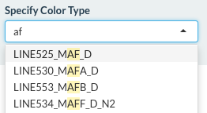

# **scHemer Guide**
**N.B.** All hyperlinks will either redirect to a location inside this document or open a new tab/browser window. Thus, clicking on any link will not exit your current session. 
  
#### **Contents:**
* [Basic User Guide](#bug)
* [Color Selection](#cs)
* [FAQ](#faq)

### **Basic User Guide**
The browser for **scHemer** is housed on the "Visualize" tab. The side panel contains the basic functionality for the selecting the color mechanism for each point, which represents a single cell. Users can select custom color themes whenver a transcription factor is set. The slider represents the score thresholds for the maximum and minimum values that are colored at the extremes of the dynamic range. In other words, the left slider sets the value that will be the lowest on the color scale. Every value lower than this is plotted as the minimum color and vice-versa for the maximum/right slider. 

### **Color Selection**
While the attribute for the color selection input is a drop down list, this is also dynamically searchable based on the user's text input. For example, starting to type 'af' will highlight all instances of that string in the available choices. This facilitates a more rapid selection of a particular motif and transcription factor of interest.   

  
By design, the "Cluster" and "Cell" definitions are categorical according to the established color paradigm. The transcription factor scores are visualized as continuous variables. 

### **FAQ**
#### **What do these 'Line' numbers mean in the transcription factor?**
Nothing special. Just a way of annotating.   

#### **What does the trailing 'N1', 'N2', etc. mean?**
These are different quality scores associated with the transcription factor motifs scored.   

  

