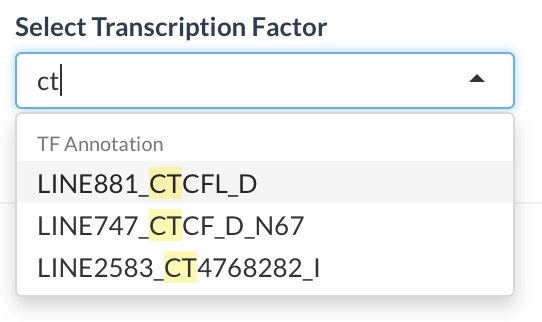

# **scHemer Guide**
**N.B.** All hyperlinks will either redirect to a location inside this document or open a new tab/browser window. Thus, clicking on any link will not exit your current session. 
  
#### **Contents:**
* [Basic User Guide](#bug)
* [Color Selection](#cs)
* [Transcription Factor Motif](#tfm)
* [FAQ](#faq)

### **Basic User Guide**
The browser for **scHemer** is housed on the "Visualize" tab. The top panel contains the basic functionality for the selecting the color mechanism for each point, which represents a single cell. By design, the "Cluster" and "Cell" definitions are categorical according to the established color paradigm. Users can select custom color themes whenever a transcription factor is selected. For this selection, the slider represents the score thresholds for the maximum and minimum values that are colored at the extremes of the dynamic range. In other words, the left slider sets the value that will be the lowest on the color scale. Every value lower than this is plotted as the minimum color and vice-versa for the maximum/right slider. By default, we set the maximum and minimum values to two standard deviations from the mean score for the factor. 

### **Transcription Factor Selection**
While the attribute for the color selection input and transcription factor is a drop down list, this is also dynamically searchable based on the user's text input. For example, starting to type 'ct' will highlight all instances of that string in the available choices. This facilitates a more rapid selection of a particular motif and transcription factor of interest.   

  
The transcription factor scores are visualized as continuous variables. Users can also choose to sort the different factor options by the variability in the scores (in descending order). 

### **Plotly**
The 3D scatter plot is rendered using <a href="https://plot.ly/" target="_blank">plotly</a>. On the upper right corner of the plot, some parameters to customize the interactive experience are present (shown below), including saving the present plot.   

### **Transcription Factor Motif**
Whenever a transcription factor is selected, the motif associated with that factor can be displayed as a logo plot at the bottom in a collapsible panel.

### **FAQ**
#### **What do these 'Line' numbers mean in the transcription factor?**
Nothing special. Just a way of annotating.   

#### **What does the trailing 'N1', 'N2', etc. mean?**
These are different quality scores associated with the transcription factor motifs scored.   

  

